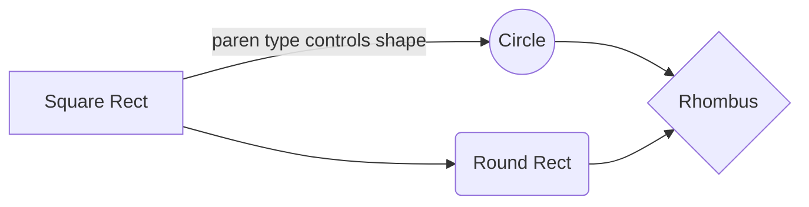
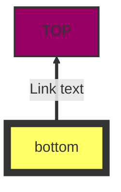
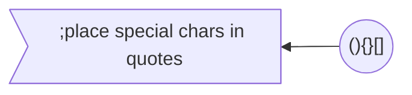
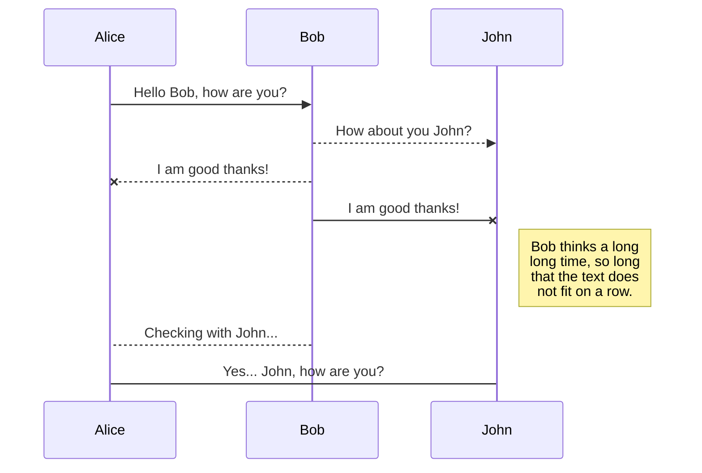
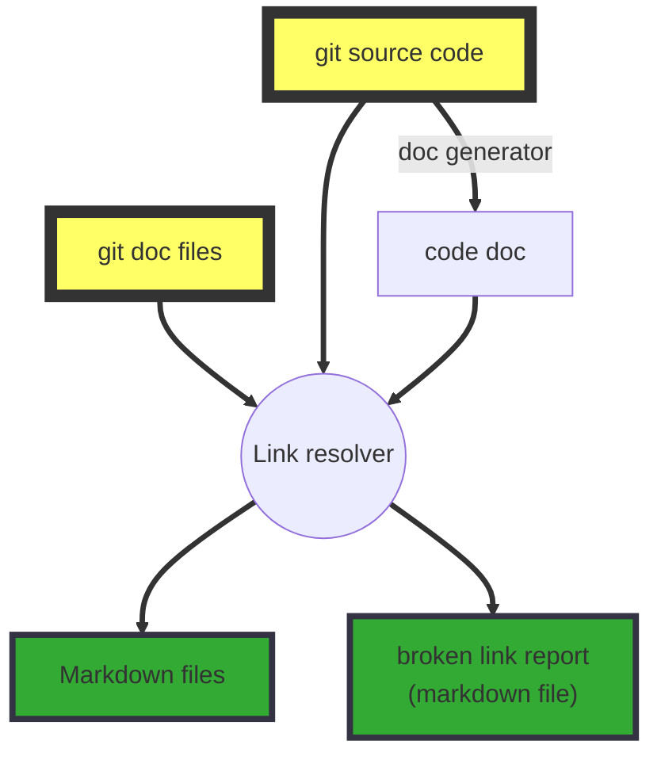

{
"title": "CWIK"
} 

## Overview

*Cwik* (pronounced 'quick') is an editable documentation web site (wiki) that is quite different from what has been done before:

 - All pages are stored in an enhanced Markdown format
 - Pages are stored in a source control system (git)
 - Edits are signed by cryptocurrency tokens
 - Integrated with source code documentation generators

## Enhanced Markdown
Here are some examples:

### Math
[Full Documentation](https://katex.org/docs/supported.html)
The *Gamma function* satisfying $\Gamma(n) = (n-1)!\quad\forall n\in\mathbb N$ is via the Euler integral
$$
\Gamma(z) = \int_0^\infty t^{z-1}e^{-t}dt\,.
$$

### Flowchart
[Full Documentation](https://mermaidjs.github.io/#/flowchart)

### Protocol (Sequence) diagram
[Full Documentation](https://mermaidjs.github.io/#/sequenceDiagram)

## Git storage

Your changes accumulate in local storage on the server.  Press the "commit" button (upper right) to commit all edits.

Look here: https://github.com/bitcoin-unlimited/BUwiki to see the backing repository.

## Token Integration
TBD

## Source Documentation Generation
**To be implemented**

This system is able to integrate multiple Git-hosted repositories.  A typical configuration would be one documentation focused repository and multiple source repositories.  These source repositories can provide inline documentation that is extracted via various documentation generators (subsequently called "codedoc") and provide access to "raw" source code.

Linking between documentation and code/codedoc or codedoc to codedoc occurs via a special syntax that allows references to code blocks, is tolerant of some code reorganizations, and identifies and records broken links for human repair.

There is a processing step to convert these links to .md format.  So the full source data preparation steps are:

