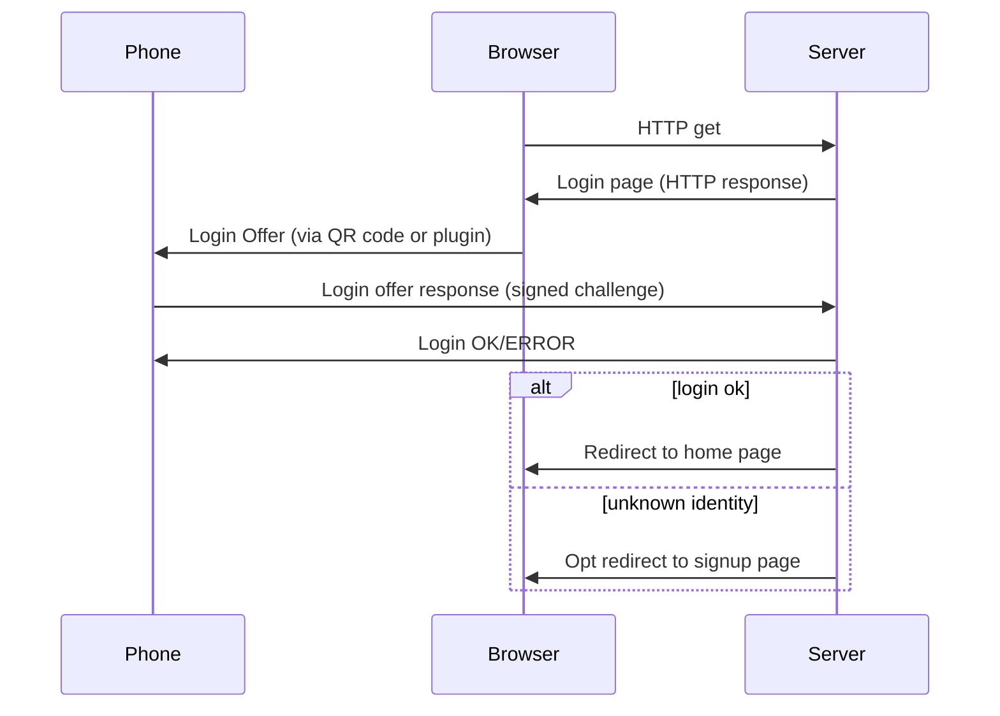

# Identity Protocol (Login)
The identity protocol allows software to interface with a server, securely supplying information such as login credentials and identity information. This “crypto-identity software” could be embedded into bitcoin wallets or be a special purpose app.

## Overview

Passwords are a pain and are insecure.  If you use the internet, you have no doubt experienced the pain.  And much has been written about how human-interaction problems create insecurities -- people choose short or simple passwords, repeat passwords across time and sites, write passwords down, etc.  These problems are addressed by password manager programs, but these programs have their own problems --  passwords are either backed up on the "cloud" (less secure), or cannot be easily transferred between browsers and computers.

We all know that entering your password into an untrusted computer is dangerous, and that entering your password into a trusted computer on an untrusted or insecure web site is dangerous.  But [homograph attacks](https://en.wikipedia.org/wiki/IDN_homograph_attack) can make this very hard to see, and typosquatting can fool the unwary.

If a password needs to be entered, it should be entered only into hardware that is provided by (and presumably more trusted by) the person who knows the password.  

Entering your password into a trusted computer on a trusted, secure web site is not entirely secure -- an IT professional working inside the organization could serve you a patched web site with a bit of javascript that sends him/her your password.  Or a deep dependency could insert some malicious code that goes live when the engineers upgrade the site's software to the latest versions.  The password entry handling software should not be separately implemented by every web site and served every time the web site is accessed.  The volume and rapid update cycles makes independent validation infeasible.  Instead, a few software implementation should handle password entry for many sites, and should be updated rarely.

Fundamentally, the act of entering passwords into untrusted software on untrusted machines creates a large number of vulnerabilities.

Let's fix these problems.

## Operation

This system is implemented in an crypto-identity app or sub-function of a Bitcoin Cash wallet, most commonly located on a phone or tablet (mobile device).  The login function of the system works in 2 modes: using a password-optional public/private key login scheme, and as a traditional password manager.

In password manager mode, a browser plugin is used to communicate between the browser and phone.  The vulnerabilities that a password manager solves and does not solve are well known so this operation mode is not the main focus of this document.

The password-optional login requires server-side changes but is much more secure.  To begin, the server/web site is provided a Bitcoin Cash address during the sign-up process.  The server will use this address to verify a user by checking that the user knows the associate private key.

During login, the web site provides the user's crypto-identity app with a challenge string consisting of random data.  This challenge string is transmitted to the user's app visually via a QR code, directly via a link, or via a browser plug-in that has previously been securely introduced to the crypto-identity app.  After an optional password entry unlocks the crypto-identity app, and/or a site-specific very secure password is entered, the app generates a private key based on a key derived from the wallet's master private key and the optional site-specific password.  The app uses this key to sign a message consisting of the website's domain, the operation being performed (login), and the challenge string.  This is communicated directly from the crypto-identity app to the web site via a HTTP get request to effect a log in.


### Problems Solved

In the "overview" section I identified a few problems with current log in schemes.  This section lists these problems and how they are solved:

1. *Remembering passwords*:  Secret keys are stored on the user's phone -- the only password that must be remembered is to unlock the phone and/or the Bitcoin Cash wallet app, for low security websites.
2. *Repeating passwords*: The login process does not use passwords, or provides a different password to each web site (when in password-manager mode).
3. *Entering passwords into untrusted machines or software*:  Login is passwordless -- the only passwords needed unlocks the crypto-identity app or is used to derive a private key on the users phone .   This is entered into the user's own device, running dedicated software.  This is not a guarantee of security -- but it is arguably a lot more secure than running arbitrary software on unknown machines. 
4. *Backing up password manager data*: The app uses a Bitcoin Cash Hierarchical Deterministic (HD) wallet.  This means that the wallet can be backed up once upon creation by saving a 12 word recovery phrase.  This means that it is possible to recover logins that did not exist at the time this phrase was written down, so it is unnecessary to back up the wallet periodically.  This makes it unnecessary to store this sensitive data in the "cloud".
5. *Use on multiple machines*: Password data does not need to be synchronized across machines as is required with password managers, since it can be located on a portable device.  Regardless, it is possible to place the user's wallet on multiple devices (or to upgrade a device) by entering the recovery phrase.
6. *Homograph/typosquatting attacks*: An app is not fooled by visually similar domain names so it will not recognize the web site that is requesting a login.  Even if the user is fooled into registering with the attacking site, a different public key is provided to that site.  The wallet also incorporates the domain name of the requesting web site into the message it signs, so this signature cannot be successfully replayed on the legitimate web site.  As stated in the caveats, a combined homograph/typosquatting and MITM attack is still possible to gain a session with the targeted server as the targeted user, if a QR code is used rather than a plugin.  However, the username and password is not compromised, and the engineering capability "bar" to pull off this attack is raised. 
7. *login using an insecure/public computer*:  In the challenge-type login, the secret key never leaves your phone, and the signed message is not communicated through the insecure computer, so a compromised computer cannot access it.  There is also no chance that the user accidentally saves his login information in the browser.
8. *IT professional code injection*:  The challenge-type login never communicates a password that can be stolen, and the signed challenge cannot be used to access any other web site or session within this site.

### Caveats

*“A common mistake that people make when trying to design something completely foolproof is to underestimate the ingenuity of complete fools.”* 
― Douglas Adams, [Mostly Harmless](https://www.goodreads.com/work/quotes/2842984)

Like a password manager, all your passwords are in one place.  Compromising the password protecting this app or the app itself will expose all passwords.  

Storing passwords in app on your personal mobile phone may give attackers greater opportunity for physical access than a using a computer that does not leave your home.       

If two factor authentication (2FA) is also enabled, use a yublikey or other dedicated device.  Loading both crypto-identity software and 2FA software on the same device defeats the purpose.

A combination homograph/MITM attack is possible if QR codes are used to send the login offer to the phone.  In this scenario, Alice wants to connect to Sally,  but is fooled via a homograph or typosquatting URL into connecting to Mallory.  Mallory contacts Sally, is allocated a session, and receives the login page.  Mallory presents it to Alice.  Alice uses the crypto-identity app to scan the provided QR code and log in by communicating directly to Sally (if a plugin is used, the plugin would detect that the domain in the login URI does not match the domain serving the login offer, defeating the attack).  This authenticates Mallory's session, allowing him to access for as long as the session is open.  Note that this attack is also possible using traditional login techniques, and in that situation Mallory gains Alice's username and password.  One possible solution to this problem is to have Alice sign every http get and put request she sends to Sally, and of course Sally validates these signatures.  With this change, Mallory can spy on the session, but cannot issue his own requests.  However, this is a major change to the operation of the server and is beyond the scope of this document.

In some situations, it is possible for a remote attacker to request a login to your app.  For example, s/he could send you a photo of the login QR code, or a paired browser plugin might automatically connect to your crypto-identity app.  This could be a feature to give someone temporary access.  But don't OK a login if you are not sure where its coming from!

*Given these caveats, this system may be more appropriately used for the many low security logins needed by the typical internet user, rather than the few high security logins!*

## Protocol Description



### Login Offer
The server provides a URI (or a QR-encoded URI) of the following format (bold indicated variable fields):

bchidentity://**domain**/**path**?op=login&chal=**challengeString**&cookie=**cookie**

**Fields**:

**domain**: domain name of the site to log into (e.g. "www.bitcoinunlimited.net".  Also include the port using the standard :number format if it is not the default http port.  Use ":443" to request a https response.
**path**: where to send the response (e.g. "/login/auto")
**challengeString**: an arbitrary string chosen by the server that is unique for every login and contains sufficient entropy to make repeats incredibly unlikely.  The challenge string MUST only contain ASCII alphanumeric characters (A-Z, a-z, 0-9, and _).
**cookie**: arbitrary data chosen by the server that will be sent back to the server during the login response.  For web sites, this is often the originating session identifier since the login response will likely arrive in a different session.

All fields MUST be supplied.

### Communication

If the login is to a web site, the server presents the login offer as a link and optionally a QR code.  The server listens for a HTTP or HTTPS "get" message to **domain**/**path**, described below.

For other server types, communication of this URI is beyond the scope of this document.

The crypto-identity app should register itself as the handler for the "bchidentity" URI protocol identifier in the fashion appropriate to the platform it runs on.  This will ensure that clicking on a web link or the generic processing of this QR code will open the crypto-identity app.

On desktop platforms, a browser plugin may register the "bchidentity" URI, and be used to proxy the bchidentity URIs to a paired mobile phone.

### Login Offer Response

For web servers, the crypto-identity app creates and issues a http "get" request of the following format:

http://**domain**[**:port**]/**path**?op=login&addr=**identity address**&sig=**signature**

**domain**, **port**, **path**: These parameters are provided by the login offer.

**identity address**: This is the Bitcoin Cash address that this site knows as your identity.  This MUST be sent in "cashaddr" format.

**signature**: The URL-encoded signature calculated as described in the *Signature Computation* section of this document.

Additional fields are ignored (not an error).

#### Server response to a login attempt

The server MUST reply to the Login Response message with the following error codes and strings:

*200: "login accepted"*
	Success!  Along with sending this response to the crypto-identity app, the server SHOULD redirect or update the client's browser away from the login screen.
	
*200: "bad signature"*
	The signature is incorrect
	
*404: "unknown session"*
	The cookie does not match any known session.  The session has probably expired in the server and the user needs to reload the web page.
	
*404: "unknown operation"*
	The desired operation is not supported by this server

*401: "unknown identity"*
	The supplied bitcoincash address does not match any registered users.  The server MAY redirect or update the client's browser away from the login screen, to a new user signup screen.  But the server SHOULD still accept at least 33 login attempts (the wallet recovery process requires testing a few possible identities) before invalidating the login offer (it is best to not invalidate the login offer at all until the session expires).

## Crypto-identity App Operation

### Identity management
The crypto-identity app has the concept of "common identities" and "unique identities".  A common identity is deliberately used across multiple domains to link accounts.  A unique identity is probabilistically given to just one web site.

Apps can use any method to organize identities.  However, to ensure seed recovery compatibility, apps SHOULD follow these procedures to choose a private key or username/password for every log in.

#### Choosing a public/private key for challenge based authentication

First use BIP32 compliant HD wallets with the following BIP44 compliant derivation path:

m/44'/0x1c3b1c3b'/0'/0/**index**

If the user enters a site-specific passphrase then the actual private key is the SHA256( derivation key + passphrase), otherwise the derivation key itself is used as the private key.

**index**: use 0-31 if a "common identity" is desired, otherwise, derive an index from the server domain name using the following algorithm:
```
uniquifier = DeriveChildKey(m/44'/0x1c3b1c3b'/0'/0/0xffffffff)
bytes = SHA256(SHA256(domain name + uniquifier))  # where + is string concatenation
index = bytes[0]&~31 + bytes[1]*256 + bytes[2]*256*256 + hash[3]*256*256*256
```
The purpose of the uniquifier is to make sure that a web site cannot engineer an identity collision with another site.  


This organization provides 32 possible "common identities", and an algorithmic way to recover unique identities from the HD wallet seed.  If the user cannot remember whether a common or unique identity was used, it is possible to try logging in with all 33 identities.  In practice it is unlikely that a user will need more than a few common identities, so an efficient recovery algorithm would be to try the unique identity first and then the common identities starting with 0.  But, if implemented simply, this may allow a server to infer a relationship between the common identities -- a paranoid implementation will need to recover identities slowly and through separate networks and sessions.  Finally, it should be emphasized that this is only a concern for the last-resort option of key recovery from seed phrase.  A privacy conscious user should back up his wallet regularly to avoid this situation, or use unique identities and a single common identity.

#### Choosing a username/password for traditional authentication
TBD

### Signature computation

The crypto-identity app signs the following string using a Bitcoin-standard pubkey recoverable ECDSA signature algorithm:

"Bitcoin Signed Message:\n**domain**[**:port**]\_bchidentity_**op**\_**challengeString**"

The first component of the string to be signed is "Bitcoin Signed Message:\n".  This is automatically prepended to every non-transaction message signed by most current bitcoin wallets and bitcoin libraries so you may not need to include it.

**domain**: the domain name of the login request.  To defeat some "man-in-the-middle" attacks, signing apps MUST ensure that this string actually IS the domain to which the response is sent.

**port**:  If the port is 80 (http) or 443 (https) then the port and preceding colon MUST be omitted.

**op**: This is the operation specified in the request URI.  Currently this must equal "login".

**challengeString**: This is the challengeString received in the login offer.  The signer MUST ensure that it complies with the challengeString rules (as stated above).

The reason the prefixes, domain name, and operation is included in the signature, and the content of the challenge string is restricted, is to make it extremely unlikely that a challenge string can be replayed in another context.  For example, if just the challenge string was signed, a server could send the app a valid bitcoin transaction as the challenge, potentially stealing money.  If the operation was omitted, a server could make it seem like an individual signed a legal document or embarrassing statement.  If the domain was omitted, it may be possible to replay the signature on another site.