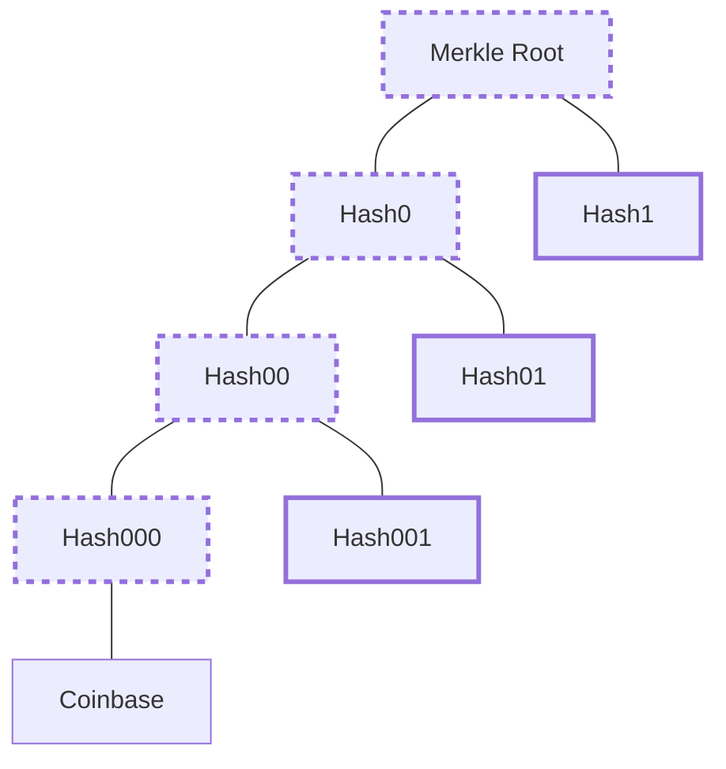

# Stratum Protocol

The stratum protocol is used by [ASIC](https://en.wikipedia.org/wiki/Application-specific_integrated_circuit) miners, devices created specifically for performing Bitcoin [mining](/protocol/blockchain/proof-of-work/mining).

Miners use this protocol to reach out to one or more servers (e.g. a mining pool) in order to obtain a template for a new [block](/protocol/blockchain/block).
The template has gaps where random data can be added until the the miner successfully creates a candidate block that meets the specified difficulty requirements.

## Message Format

Stratum uses the [JSON-RPC 2.0](https://en.wikipedia.org/wiki/JSON-RPC) message format.
That is, [JSON](https://en.wikipedia.org/wiki/JSON)-encoded messages, separated by newline (line feed) characters.
There are two high-level message formats: requests and responses.

### Requests

Requests all contain the following fields:

| Field | Format | Description |
|--|--|--|
| id | number or string | A message ID that must be unique per request that expects a response.  For requests not expecting a response (called notifications), this is null. |
| method | string | Indicates the type of request the message represents. |
| params | array | Additional data which varies based on the request method. |

### Responses

Responses all contain the following fields:

| Field | Format | Description |
|--|--|--|
| id | number or string | The ID of the request that this message is a response to. |
| result | any | Data being returned in response to the request.  Must be present, but may be a string, number, array, object, or null. |
| error | [error array](#error-array-format) | Indicates that the request could not be fulfilled and provides information about what went wrong. |

#### Error Array Format

The error array is a JSON array containing the following elements:

| Field | Format | Description |
|--|--|--|
| error code | number | An error code indicating the type of error. |
| message | string | A description of the error. |
| data | object | Additional data associated with the error (nullable). |

*Example error:* <code>{"result":null,"id":2,"error":[24,"Unauthorized worker",null]}</code>

Beyond those specified by JSON-RPC, the following error codes are used:

| Code | Description |
|--|--|
| 20 | Other/Unknown |
| 21 | Job not found (=stale) |
| 22 | Duplicate share |
| 23 | Low difficulty share |
| 24 | Unauthorized worker |
| 25 | Not subscribed |

## Client Methods

### mining.subscribe

Upon connecting to a server, clients are expected to send a subscribe request, described as follows.

| Field | Format | Description |
|--|--|--|
| method | string | "mining.subscribe" |
| params\[0\] | string | User agent and version, separated by a forward slash (e.g. "Node/1.0.0"). |
| params\[1\] | string | Suggested extra nonce value (optional). |

*Example request:* <code>{"id": 1, "method": "mining.subscribe", "params": ["Node/1.0.0"]}</code>

In response, the server will send the following data in its result object, which is a JSON array:

| Field | Format | Description |
|--|--|--|
| subscriptions | array | An array containing sub-array that described intended subscriptions.  The first value in sub-arrays is the subscription type (e.g. "mining.set_difficulty"), the second is a subscription ID. |
| extra nonce 1 | string | The selected extra nonce 1 value. |
| extra nonce 2 byte count | number | The size, in bytes, that the extra nonce 2 should be. |

*Example response:* <code>{"result":[[["mining.set_difficulty","731ec5e0649606ff"],["mining.notify","731ec5e0649606ff"]],"e9695791",4],"id":1,"error":null}</code>

### mining.authorize

In order to authenticate itself, the client send an authorize message:

| Field | Format | Description |
|--|--|--|
| method | string | "mining.authorize" |
| params\[0\] | string | The client's user name. |
| params\[1\] | string | The client's password (if required by the server). |

*Example request:* <code>{"id": 1, "method": "mining.authorize", "params": ["username", "p4ssw0rd"]}</code>

Response format:

| Field | Format | Description |
|--|--|--|
| result | boolean | The value true if the client has been authorized; false otherwise. |

*Example response:* <code>{"id": 2, "result": true, "error": null}</code>

### mining.submit

Once the client has completed a job (received via [mining.notify](#miningnotify) following an accepted [mining.authorize](#miningauthorize)), it returns its result using a submit message.
This message is also used to submit shares to a mining pool.
The format is as follows:

| Field | Format | Description |
|--|--|--|
| method | string | "mining.submit" |
| params\[0\] | string | The client's user name. |
| params\[1\] | string | The job ID for the work being submitted. |
| params\[2\] | string | The hex-encoded value of extra nonce 2. |
| params\[3\] | string | The hex-encoded time value use in the block header. |
| params\[4\] | string | The hex-encoded nonce value to use in the block header. |

*Example request:* <code>{"id": 1, "method": "mining.submit", "params": ["username", "4f", "fe36a31b", "504e86ed", "e9695791"]}</code>

Response format:

| Field | Format | Description |
|--|--|--|
| result | boolean | The value true if the submission has been accepted; false if it was rejected. |

*Example response:* <code>{"id": 2, "result": true, "error": null}</code>

## Server Methods

### mining.notify

Once a client successfully connects using the [mining.subscribe](#miningsubscribe) and [mining.authorize](#miningauthorize) messages, the server may send a job to the client, informing it of everything it needs to know in order to mine a new block.
The notify message is a notification (does not expect a response) and has the following format:

| Field | Format | Description |
|--|--|--|
| method | string | "mining.notify" |
| params\[0\] | string | The job ID for the job being sent in this message. |
| params\[1\] | string | The hex-encoded previous block hash. |
| params\[2\] | string | The hex-encoded prefix of the coinbase transaction (to precede extra nonce 2). |
| params\[3\] | string | The hex-encoded suffix of the coinbase transaction (to follow extra nonce 2). |
| params\[4\] | array | A JSON array containing the hex-encoded hashes needed to compute the [merkle root](/protocol/blockchain/block/merkle-tree).  See [Merkle Tree Hash Array](#merkle-tree-hash-array). |
| params\[5\] | string | The hex-encoded block version. |
| params\[6\] | string | The hex-encoded network difficulty required for the block. |
| params\[7\] | string | The hex-encoded current time for the block. |
| params\[8\] | boolean | Indicates whether the client should forget any prior jobs.  If true, the server will reject any submissions for prior jobs and the miner should forget any prior job IDs so that they can be reused by the server. |

*Example request:* <code>{"id": null, "method": "mining.notify", "params": ["bf", "4d16b6f85af6e2198f44ae2a6de67f78487ae5611b77c6c0440b921e00000000",
"01000000010000000000000000000000000000000000000000000000000000000000000000ffffffff20020862062f503253482f04b8864e5008",
"072f736c7573682f000000000100f2052a010000001976a914d23fcdf86f7e756a64a7a9688ef9903327048ed988ac00000000", [],
"00000002", "1c2ac4af", "504e86b9", false]}</code>

#### Merkle Tree Hash Array

The array of merkle tree hashes in the [mining.notify](#miningnotify) request, denote (in order) the hashes that should be iteratively composed with the coinbase transaction has to ultimately generate the merkle root.
In the simplest case, where the block will only contain the coinbase transaction, the array is empty and the coinbase transaction hash becomes the merkle root.
When there are more transactions, however, the merkle tree hash array contains the leaf nodes of the partial merkle tree, as shown below.

In the example above, dashed lines indicate hashes that must be computed, while bold lines indicate hashes are are included in the merkle tree hash array, which in this case would be: <code>["Hash000", "Hash00", "Hash0"]</code>.
So after the coinbase transaction is created, it is hashed into `Hash000`.
Then `Hash000` and `Hash001` are hashed together to create `Hash00`, and so on until the Merkle Root is computed.

## mining.set_difficulty

When reporting shares to the server, clients are expected to default to a [difficulty](/protocol/blockchain/proof-of-work#difficulty) of 1 (a [target](/protocol/blockchain/proof-of-work#target) of: `0x00000000ffff0000000000000000000000000000000000000000000000000000`).
At any point, however, the server can change that threshold by sending a `set_difficulty` message:

| Field | Format | Description |
|--|--|--|
| method | string | "mining.set_difficulty" |
| params\[0\] | number | The new difficulty threshold for share reporting.  Shares are reported using the [mining.submit](#miningsubmit) message. |

*Example request:* <code>{ "id": null, "method": "mining.set_difficulty", "params": [2]}</code>