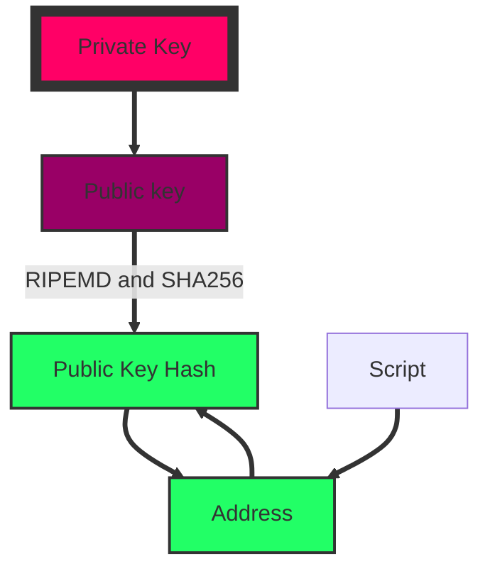

{
"title": "Wallet Objects"
} 

The following graph shows the derivation relationship between wallet objects.

```mermaid
graph TB
PrivK["Private Key"] ==>PubK[Public key]
PubK == RIPEMD and SHA256 ==> PubKH[Public Key Hash]
PubKH==>Address
Address==>PubKH
Script==>Address
style PubK fill:#906,stroke:#333,stroke-width:2px;
style PrivK fill:#f06,stroke:#333,stroke-width:8px;
style PubKH fill:#2f6,stroke:#333,stroke-width:2px;
style Address fill:#2f6,stroke:#333,stroke-width:2px;
```