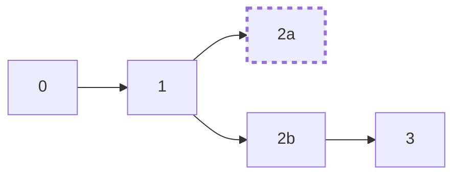

# Blockchain

## What is a Blockchain

The Bitcoin Cash Blockchain is a linear collection of [Blocks](/protocol/blockchain/block).
The "state" of the blockchain is calculated by sequentially executing each set of changes (in the form of [Transactions](/protocol/blockchain/transaction)) included in each Block.

When a Block is created it includes the [Hash](/protocol/blockchain/hash) of the previous block; this cryptographically ensures the Block's parent block cannot be changed without completely rebuilding the new block.
This chaining structure is similar to [Git](//git-scm.com) commits&mdash;where a block is analogous to a commit (a set of file changes), and each commit's parent is tied directly to its parent, forming a chain.
Unlike Git, in order to create a commit (i.e. a Block) a certain amount of work must be performed.
This [Proof of Work](/protocol/blockchain/proof-of-work) prevents blocks from being created instantly, and is the mechanic that prevents old history from being rewritten, since modifying a block would change its hash and disconnect it from its previous children.
Therefore, changing a block requires that each of the child blocks be recreated as well.
With this property, changing old blocks becomes nearly impossible as long as the Work to create a block is sufficiently time-intensive.

## Block Height

Blocks are applied sequentially, and therefore for a given chain, a block can be identified by its distance from the Genesis Block.
This distance is commonly referred to as `Block Height`.
There may be multiple blocks at the same `Block Height` if two blocks are built that share a previous Block's Hash.
Multiple Blocks with the same `Block Height` are often referred to as "sibling" Blocks, or "contentious" blocks.
Sibling Blocks can happen if a Block is created with sufficient Work before the mining Node has been made aware of the new (Sibling) Block.
Sibling Blocks are incompatible with one another, and eventually one will become orphaned.
The [Genesis Block](/protocol/blockchain#genesis-block) is the first Block in a chain, and has a `Block Height` of `0` (as its distance to the Genesis Block is zero).

As of [BIP-0034](/blockchain/forks/bip-34), the `Block Height` is included within the [Coinbase Transaction](/protocol/blockchain/block#coinbase-transaction).

## Work

The longest valid chain with the most [Proof of Work](/protocol/blockchain/proof-of-work) is generally considered to be the main chain.
Work can be quickly verified by evaluating the Block's [Difficulty](/protocol/blockchain/proof-of-work/difficulty) and validated by checking the Block's hash.
[Chain Work](/protocol/blockchain/proof-of-work#chain-work) is the summation of all work done on each block up to a point on the Blockchain.
As of [HF-20171113](/protocol/forks/hf-20171113), Chain Work is used to calculate new Block's [difficulty adjustment](/protocol/blockchain/proof-of-work/difficulty-adjustment-algorithm) as of Block Height.

## Blockchain Reorganization

When two valid blocks share the same block height, they are considered contentious blocks.
Contentious blocks can happen organically due to the random nature of mining&mdash;the likeliness being proportional to the block propagation speed and the time between blocks.
Slow-propagating blocks require a longer block interval in order to prevent contentious blocks.

When two blocks become contentious, the first-seen block is usually considered the valid block on the main chain; however, different nodes across the network may have seen different blocks first.
Consensus is formed when a second block is mined on a contentious block.
This second block may also be contentious, although a rare circumstance.
In this case, the process repeats and the race continues until consensus is reached.


```diagramLabel

1.  Blocks 2a and 2b are mined before the either have fully propogated throughout the network.

2.  Some Nodes follow Block 2a, others follow Block 2b, depending on which Block they received first.

3. Block 3 is mined on top of Block 2b.  Nodes originally following Block 2a abandon Block 2A, and begin following Block 2b/3.

```



Switching from one chain to another chain is often called a "Reorg"&mdash;short for "Blockchain Reorganization".
When a Reorg occurs, Transactions that were previously valid may become invalid if a Transaction on the other chain spent the same [Transaction Output](/protocol/blockchain/transaction#transaction-output) as one if its [Transaction Inputs](/protocol/blockchain/transaction#transaction-input).

## Genesis Block