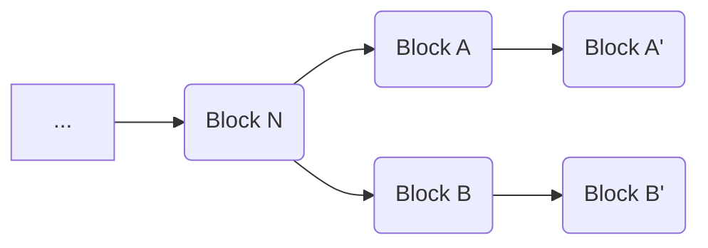

# Block-Level Validation Rules

When validating a transaction, it must be done within the context of a block.  That may be a historical (or new) block that the transaction is a part of or it may be as a part of a hypothetical "next" block.  The latter category, often referred to as "mempool" transactions, represent transactions that a node is aware of, and considers valid, but that have not yet been added to a block.  In this case, they are treated as though they are all in a new block that follows after the last block in the longest chain the node is currently aware of.

The reason that transaction validation is context-dependent in this way stems from what is probably the most important validation rule: the inputs to a transaction must be a UTXO.  That is, transactions must spend transaction outputs that were created by a prior transaction but that have not been spent by another transaction in the target block or its history.  Note that this means that blocks with divergent histories will treat different transactions as valid.  For example, consider the following scenario:

Since `Block A'` and `Block B'` are at the same block height, there may be some nodes that treat `Block A'` as the most recent block (e.g. `Node A`) and others that treat `Block B'` as the most recent block (e.g. `Node B`).   If a transaction is submitted to both `Node A` and `Node B` that spends an output created in a transaction in `Block A`, `Node A` may consider the transaction valid while `Node B` would reject it on the grounds that it is dependent on a UTXO that is not a part of `Block B'`'s history, which only contains `Block B'`, `Block B`, and `Block N` (and its parents).

Other block-level validation rules include:

 - Coinbase Transaction Reward Validation
	 - The coinbase transaction in a block must collect the correct reward for the block height.  For more information see [Coinbase Transaction](/protocol/blockchain/block#coinbase-transaction).
 - Coinbase Transaction Block Height
	 - The coinbase transaction in a block must provide an unlocking script that that starts with a push operation which pushes the block height of the block it is contained in.
	 - This requirement was added in [BIP-34](/protocol/forks/bip-0034) to ensure that coinbase transactions are unique.