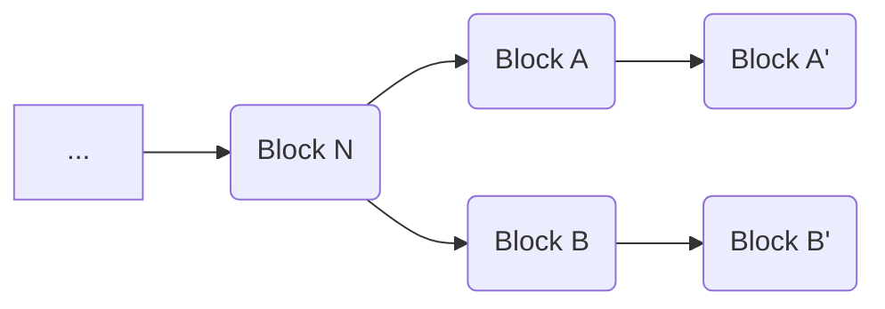

# Block-Level Validation Rules

Block-level validation rules, also referred to as consensus rules, define what is permitted to be included in a block.
Block-level validation rules are absolute and any block or transaction that would cause a violation such a rule must be rejected.
These differ from [network-level validation rules](/protocol/blockchain/transaction-validation/network-level-validation-rules), also referred to as standardness rules, which can be circumvented by miners, should they wish to include a non-standard transaction in a block.
In short, consensus (block-level) rules define what is permitted in a block, while standardness (network-level) rules define recommended behavior for nodes on the network.

When validating a transaction, it must be done within the context of a block.  That may be a historical (or new) block that the transaction is a part of or it may be as a part of a hypothetical "next" block.  The latter category, often referred to as "mempool" transactions, represent transactions that a node is aware of, and considers valid, but that have not yet been added to a block.  In this case, they are treated as though they are all in a new block that follows after the last block in the longest chain the node is currently aware of.

The reason that transaction validation is context-dependent in this way stems from what is probably the most important validation rule: the inputs to a transaction must be UTXOs.  That is, transactions must spend transaction outputs that were created by a prior transaction but that have not been spent by another transaction in the target block or its history.  Note that this means that blocks with divergent histories will treat different transactions as valid.  For example, consider the following scenario:

Since `Block A'` and `Block B'` are at the same block height, there may be some nodes that treat `Block A'` as the most recent block (e.g. `Node A`) and others that treat `Block B'` as the most recent block (e.g. `Node B`).   If a transaction is submitted to both `Node A` and `Node B` that spends an output created in a transaction in `Block A`, `Node A` may consider the transaction valid while `Node B` would reject it on the grounds that it is dependent on a UTXO that is not a part of `Block B'`'s history, which only contains `Block B'`, `Block B`, and `Block N` (and its parents).

## Consensus Rules

 - Double-Spend Validation
   - The inputs of a transaction may only be spent once on a given blockchain fork.
   - That is, if two transactions spend a given input, only one may be valid at any given time.
   - See [blockchain reorganization](/protocol/blockchain#blockchain-reorganization) for information on how resolution of such conflicts is resolved.
 - Transaction Input and Output Validation
   - The total value of the outputs of a transaction may not exceed the total input value of the transaction, except in the case of [coinbase transactions](/protocol/blockchain/block#coinbase-transaction).
 - Coinbase Transaction Reward Validation
	 - The coinbase transaction in a block must collect the correct reward for the block height.  For more information see [Coinbase Transaction](/protocol/blockchain/block#coinbase-transaction).
 - Coinbase Maturity
   - Outputs of coinbase transactions may not be spent for 100 blocks.
   - That is, the block reward from block 1,000 may not be spent until block 1,100.
 - Coinbase Transaction Block Height
	 - The coinbase transaction in a block must provide an unlocking script that that starts with a push operation which pushes the block height of the block it is contained in.
	 - This requirement was added in [BIP-34](/protocol/forks/bip-0034) to ensure that coinbase transactions are unique.
 - Signature Check Counting
   - The number of signature checks in a transaction may not exceed 3,000.
   - The number of signature checks in a block may not exceed the max block size divided by 141 (currently this is 226,950).
   - For details on how signature checks are counted, see [SigChecks](#sigchecks)
 - Transaction 

### SigChecks

SigChecks was implemented as a part of [HF-20200515](/protocol/forks/hf-20200515) and replaced the existing system of signature operation counting (SigOps).
During script execution, signature checks are counted using the following rules:

 - Executing OP_CHECKSIG / OP_CHECKSIGVERIFY / OP_CHECKDATASIG / OP_CHECKDATASIGVERIFY increments SigChecks by:
   - +0, if signature is NULL.
   - +1, if signature is non-NULL.
 - Executing an M-of-N OP_CHECKMULTISIG / OP_CHECKMULTISIGVERIFY increments SigChecks by:
   - +0, if all M signatures are NULL.
   - +M, if at least one signature is non-NULL and the verification is in [New/Schnorr mode](/protocol/forks/2019-11-15-schnorrmultisig) (dummy element is non-NULL).
   - +N, if at least one signature is non-NULL and the verification is in Old/ECDSA mode (dummy element is NULL).

