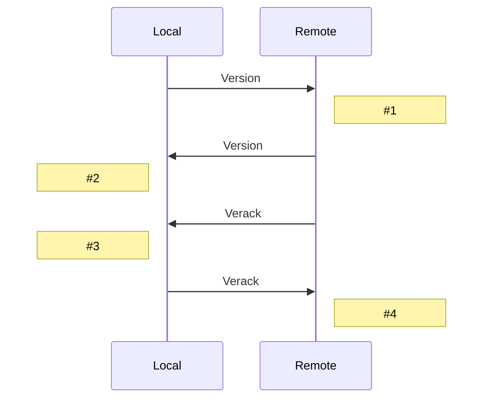

# Node Handshake

When nodes connect the issue a connection handshake in order to ensure compatibility between the two nodes.
The handshake informs the peer of its:

- Network Protocol Version
- Block Height
- Supported [Network Services](/protocol/network/messages/version#services-bitmask)

Neither Node should send any data other than a [Version](/protocol/network/messages/version) message to the peer until it has also received a Version message.
Once a node has received (and sent) a Version message, it may send a [Verack](/protocol/network/messages/verack) message.
Once each Node has sent and received a Verack message, normal node operation may begin.

## Sequence Diagram

When a local Node initiates a connection to a remote Node, the remote Node will remain silent it receives a version message.

```diagramLabel

1. Local sends Version Message to Remote containing Local's Version Number.

2. Remote sends Version Message containing Remote's Version Number.

3. If Local's Version Number is compatible, Remote uses the lower of the two Version Numbers and sends Verack Message.

4. If Remote's Version Number is compatible, Local uses the lower of the two Version Numbers and sends Verack Message.
```



The Remote Node may send a `Verack` message before it sends its own `Version` messages.

A Node may only send a `Version` message once.

Although a Node may connect to itself, it is usually undesired.  Nodes typically check for a connection to itself by checking if the `nonce` provided by a `Version` message is a nonce it has used recently.