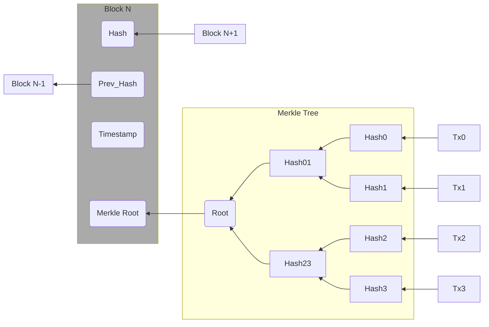

# Overview  

Bitcoin Cash is a decentralized cryptocurrency with a public distributed ledger.
Transactions are validated and transmitted over the Bitcoin Cash peer-to-peer (P2P) network, and stored in the [blockchain](/protocol/blockchain).
Bitcoin Cash utilizes the Proof-of-work timestamping scheme with SHA-256 hash function, and targets a 10-minute block time.
It also utilizes the secp256k1 parameters with ECDSA and Schnorr algorithm for digital signatures.
The ticker symbol for Bitcoin Cash is BCH.

## Design  

Bitcoin Cash operates on the blockchain which is distributed among the Bitcoin Cash network.
[Transactions](/protocol/blockchain/transaction) in Bitcoin are submitted to network nodes, which will [validate the transaction](/protocol/blockchain/transaction-validation) against the transaction history in the blockchain.
Once transactions are considered valid, they will be grouped into blocks through [Merkle Trees](/protocol/blockchain/block/merkle-tree).
Through rigorous hash computation, blocks can be mined into the blockchain by the network nodes and are subsequently broadcast to the Bitcoin Cash network.

The blockchain serves as the public ledger for Bitcoin Cash.
It consists of one single chain of blocks and each block contains the hash of its previous block.
Due to the characteristics of hash functions, the content of any block cannot be altered without changes to all its subsequent blocks.
The time and computation intensity of such change is near impossible.
Therefore, the transaction history in the blockchain can be considered immutable even with public access.

The transactions on the Bitcoin Cash is pseudonymous.
The blockchain does not keep records of coin ownerships for users.
Instead, each transaction refers to the unspent outputs of previous transactions.
The outputs of the transaction is then locked through [locking scripts](/protocol/blockchain/transaction/locking-script) and whoever holds the correct [unlocking scripts](/protocol/blockchain/transaction/unlocking-script) can use the outputs in their future transactions.

The Bitcoin Cash network is an ad-hoc decentralized network of volunteers, in which Bitcoin Cash transactions are transmitted and validated.
Messages on the network are usually broadcast on a best-effort basis.
The consensus of the blockchain is achieved through the proof-of-work mechanism, in which the chain with the most work is agreed on.
